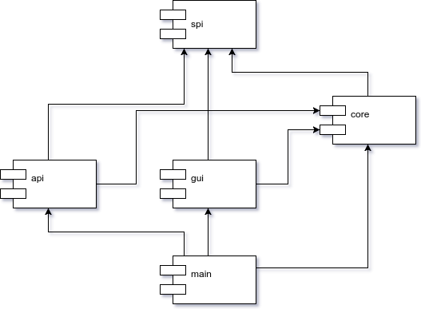

Proof of concept for modular guice app
======================================

Each module (api,core,gui) is loaded using ServiceLoader (https://docs.oracle.com/javase/tutorial/ext/basics/spi.html).
App is run by `main` module which is responsible for the lifecycle:

1. decorate parser options (each module can add it's arguments)
1. parse options
1. configure each module's guice module and create one guice module that aggregates them all 
1. start each module with the same injector built with aggregated guice module

```
mvn install
cd main
mvn exec:java -Dexec.mainClass="modular.main.Main"
mvn exec:java -Dexec.mainClass="modular.main.Main" -Dexec.args="-X"
mvn exec:java -Dexec.mainClass="modular.main.Main" -Dexec.args="--api=false"
mvn exec:java -Dexec.mainClass="modular.main.Main" -Dexec.args="--gui=false"
mvn exec:java -Dexec.mainClass="modular.main.Main" -Dexec.args="--apiPort=8000"
mvn exec:java -Dexec.mainClass="modular.main.Main" -Dexec.args="--port=8484"
mvn exec:java -Dexec.mainClass="modular.main.Main" -Dexec.args="--guiTheme=dark"
```

This example uses following arguments:

```
Option               Description                    
------               -----------                    
--api [Boolean]      Enable REST API (default: true)
--apiPort [Integer]  REST API port (default: 8080)  
--gui [Boolean]      Enable GUI (default: true)     
--guiTheme           Color theme (default: light)   
--port [Integer]     P2P port (default: 8383)
```

It's handy to prefix option names with module name to avoid collisions between modules.

Flags `gui` and `guiTheme` are defined and used only by `gui` module. 
Flags `api` and `apiPort` are defined and used only by `api` module. 
Flag `port` is defined and used by `core` module

Each module can have it's own Environment, i.e. here we've got ApiEnvironment, GuiEnvironment and CoreEnvironment.

Core module should be responsible for starting basic services while gui module should be responsible just for starting javafx.
Api module should limit itself only to opening REST API port.


